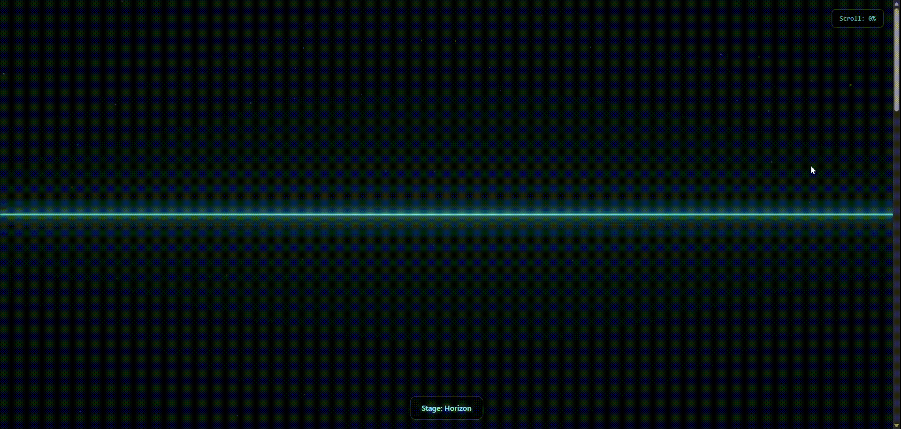

# Horizon Animation

A stunning scroll-based animation that transforms through four stages: Horizon → Cracks → Waves → DNA Helix.



## 🌟 Features

- **Smooth Scroll Animation**: Synchronized with scroll position using GSAP ScrollTrigger
- **Vertex Morphing**: All stages share the same geometry - vertices smoothly interpolate between shapes
- **Glowing Effect**: Bloom postprocessing creates the iconic blue glow
- **60fps Performance**: Optimized for smooth rendering on desktop and mobile
- **Responsive Design**: Adapts to all viewport sizes

## 🎬 Animation Stages

| Stage | Scroll Progress | Description |
|-------|----------------|-------------|
| 1. Horizon | 0% - 25% | A calm, glowing horizontal line |
| 2. Cracks | 25% - 50% | The line fractures into jagged segments |
| 3. Waves | 50% - 75% | Transforms into an animated waveform |
| 4. DNA Helix | 75% - 100% | Morphs into a rotating double helix |

## 🛠 Tech Stack

- **React 18** - Component framework
- **Three.js** - WebGL 3D rendering
- **react-three-fiber** - React renderer for Three.js
- **@react-three/drei** - Useful helpers for R3F
- **@react-three/postprocessing** - Easy postprocessing effects
- **GSAP 3** - Animation and scroll synchronization
- **Lenis** - Smooth scroll library
- **Tailwind CSS** - Styling
- **Vite** - Fast development and build

## 📦 Installation

```bash
# Clone the repository
git clone https://github.com/yourusername/horizon-animation.git
cd horizon-animation

# Install dependencies
npm install

# Start development server
npm run dev
```

## 🚀 Development

```bash
# Start dev server with hot reload
npm run dev

# Build for production
npm run build

# Preview production build
npm run preview
```

## 📁 Project Structure

```
horizon-animation/
├── src/
│   ├── components/
│   │   └── ScrollAnimation.jsx   # Main animation component
│   ├── hooks/
│   │   └── useSmoothScroll.js    # Lenis smooth scroll hook
│   ├── utils/
│   │   ├── vertexPositions.js    # Vertex generation for all stages
│   │   └── threeSetup.js         # Three.js initialization helpers
│   ├── App.jsx                   # Root component
│   ├── main.jsx                  # Entry point
│   └── index.css                 # Global styles
├── index.html
├── package.json
├── vite.config.js
├── tailwind.config.js
└── README.md
```

## 🎨 Architecture

### Vertex Position Manager Pattern

The core innovation is that **all four animation stages share the same BufferGeometry**. Instead of creating separate geometries for each stage, we:

1. Create a single `BufferGeometry` with a fixed number of vertices (200)
2. Store target vertex configurations for each stage (horizon, cracks, waves, DNA)
3. Use GSAP/manual interpolation to smoothly morph between configurations
4. Update `geometry.attributes.position` on each frame

This approach enables:
- Smooth morphing transitions between any two stages
- Consistent performance (no geometry allocation/deallocation)
- Easy addition of new stages

### Code Flow

```
User Scrolls
    ↓
GSAP ScrollTrigger captures scroll progress (0-1)
    ↓
generateVertexPositions(scrollProgress, time) called
    ↓
Returns interpolated Float32Array based on current stage
    ↓
BufferGeometry.attributes.position updated
    ↓
geometry.needsUpdate = true triggers GPU re-upload
    ↓
Three.js renders updated geometry with Bloom effect
```

## ⚙️ Configuration

### Bloom Settings

In `ScrollAnimation.jsx`:

```jsx
<Bloom
  luminanceThreshold={0.2}  // Brightness threshold for bloom
  luminanceSmoothing={0.9}  // Smoothness of threshold
  intensity={2.0}           // Glow strength
  mipmapBlur={true}         // Performance optimization
/>
```

### Vertex Positions

In `utils/vertexPositions.js`:

```javascript
export const VERTEX_COUNT = 200;      // Number of vertices
export const ANIMATION_WIDTH = 12;    // Horizontal span
export const ANIMATION_HEIGHT = 4;    // Vertical range
```

### Scroll Stages

Modify stage boundaries in `generateVertexPositions()`:

```javascript
const STAGE_1_END = 0.25;   // Horizon ends at 25%
const STAGE_2_END = 0.50;   // Cracks ends at 50%
const STAGE_3_END = 0.75;   // Waves ends at 75%
// DNA Helix: 75% - 100%
```

## 🎯 Performance Tips

1. **Pixel Ratio**: Clamped to 2 to prevent performance issues on 4K displays
2. **DynamicDrawUsage**: BufferAttribute hint for frequent updates
3. **In-place Updates**: Positions are updated in-place, no new allocations
4. **useRef for Scroll**: Scroll progress uses refs to avoid React re-renders
5. **Throttled UI Updates**: Stage label and percentage use state (throttled by React)

## 🐛 Debug Mode

Press `Ctrl+D` to toggle debug mode, which shows:
- Current scroll percentage
- Current stage name

## 📱 Mobile Considerations

- Touch scrolling works smoothly with Lenis
- Reduced animation complexity on mobile (can be configured)
- Minimum 30fps target on mobile devices

## 🔧 Customization

### Adding a New Stage

1. Create a new position generator in `vertexPositions.js`:

```javascript
export function generateMyStagePositions(time) {
  const positions = new Float32Array(VERTEX_COUNT * 3);
  // Fill positions array
  return positions;
}
```

2. Update `generateVertexPositions()` to include the new stage
3. Adjust stage boundaries as needed

### Changing Colors

Update the line material color in `ScrollAnimation.jsx`:

```jsx
<lineBasicMaterial color="#4fc3dc" />
```

And adjust Tailwind colors in `tailwind.config.js`.

## 📄 License

MIT License - feel free to use in your projects!

## 🙏 Acknowledgments

- [Three.js](https://threejs.org/) - 3D graphics library
- [react-three-fiber](https://github.com/pmndrs/react-three-fiber) - React Three.js renderer
- [GSAP](https://greensock.com/gsap/) - Animation library
- [Lenis](https://lenis.studiofreight.com/) - Smooth scroll library
